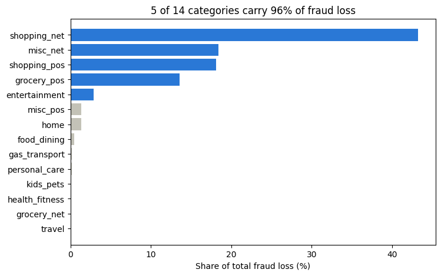
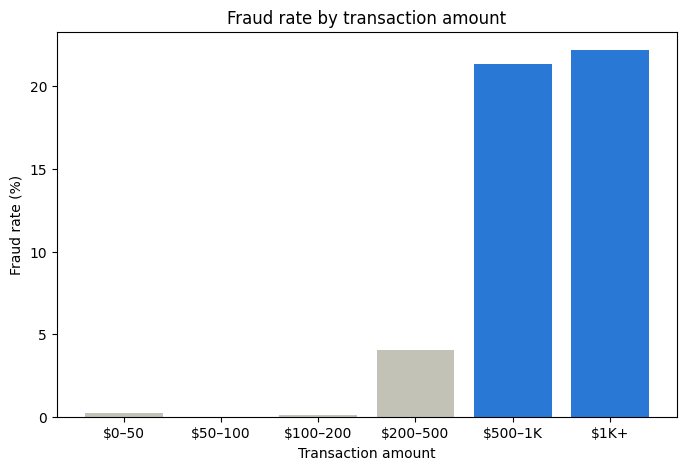

# Card Fraud Loss Quantification

Where does card fraud loss concentrate, and what would a simple
flagging rule save, at what cost?

## Findings
*1,852,394 simulated card transactions, Jan 2019 – Dec 2020*

### 1. Fraud loss is concentrated in a few categories
**5 of 14 merchant categories drove 96% of fraud loss value**
while representing 38% of transaction volume.

### 2. A $500 flagging rule catches most of the loss
**A $500+ flagging rule captures $4,233,689 (83%) of fraud loss**,
at the cost of 17,025 legitimate transactions flagged
(0.9% of legitimate transactions).

**Why $500:** the fraud rate is about 4% between $200 and $500,
then jumps to over 20% above $500. Moving the line down to $200
would flag 65,564 more transactions, about 96% of them genuine.

## Data
[Credit Card Transactions Fraud Detection](https://www.kaggle.com/datasets/kartik2112/fraud-detection)
(Kaggle, CC0), simulated with the Sparkov generator. Train and test
files were concatenated; there's no model, so no split was needed.
No missing values or duplicate transactions. `unix_time` is 7 years
off from `trans_date_trans_time` (a generator error), so dates come
from `trans_date_trans_time`.

## Method
Python (pandas, matplotlib), in [`fraud_loss_analysis.ipynb`](fraud_loss_analysis.ipynb).
Runs in Google Colab; the data downloads automatically with kagglehub.